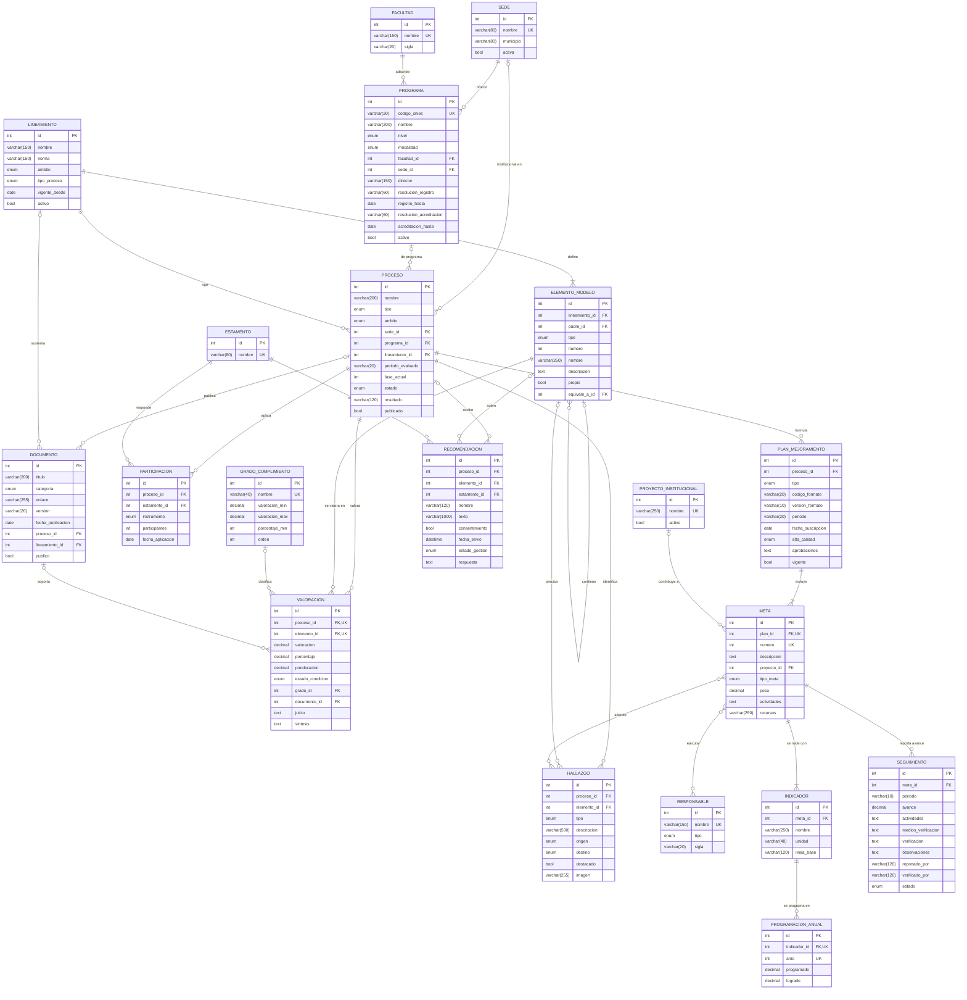

# MER v2 · Sistema de Información de Autoevaluación (Unillanos)

Modelo entidad-relación ajustado al formato **FO-GCL-20** (plan de mejoramiento), al informe de autoevaluación de Ingeniería Electrónica 2018–2022 (modelo CNA, Acuerdo CESU 02 de 2020) y al Acuerdo CESU 01 de 2025.

**20 entidades · 28 relaciones · 5 dominios.** La versión gráfica está en `MER-v2.png` / `MER-v2.pdf` (exportada de Canva). Este archivo es la versión en texto: GitHub lo dibuja solo y Claude Code lo puede leer.

Notación: pata de gallo. `||` exactamente uno · `|o` cero o uno · `|{` uno o muchos · `o{` cero o muchos.

## Dominios

- **Institución** (3): `SEDE`, `FACULTAD`, `PROGRAMA`. Sedes, facultades y programas.
- **Modelo de calidad** (4): `LINEAMIENTO`, `ELEMENTO_MODELO`, `GRADO_CUMPLIMIENTO`, `ESTAMENTO`. Lineamientos, elementos del modelo y catálogos.
- **Autoevaluación** (4): `PROCESO`, `VALORACION`, `HALLAZGO`, `PARTICIPACION`. Procesos, valoraciones, hallazgos y participación.
- **Plan de mejoramiento** (7): `RESPONSABLE`, `PROYECTO_INSTITUCIONAL`, `PLAN_MEJORAMIENTO`, `META`, `INDICADOR`, `PROGRAMACION_ANUAL`, `SEGUIMIENTO`. Metas, indicadores, programación anual y seguimiento.
- **Documentos y participación** (2): `DOCUMENTO`, `RECOMENDACION`. Documentos y recomendaciones de la comunidad.

## Relaciones (cómo se leen)

| # | Origen | Cardinalidad | Destino | Verbo | Lectura |
|---|---|---|---|---|---|
| 1 | `SEDE` | `\|\|--o{` | `PROGRAMA` | ofrece | `SEDE` ofrece *cero o muchos* `PROGRAMA`; cada `PROGRAMA` tiene *exactamente uno* `SEDE`. |
| 2 | `FACULTAD` | `\|\|--o{` | `PROGRAMA` | adscribe | `FACULTAD` adscribe *cero o muchos* `PROGRAMA`; cada `PROGRAMA` tiene *exactamente uno* `FACULTAD`. |
| 3 | `LINEAMIENTO` | `\|\|--\|{` | `ELEMENTO_MODELO` | define | `LINEAMIENTO` define *uno o muchos* `ELEMENTO_MODELO`; cada `ELEMENTO_MODELO` tiene *exactamente uno* `LINEAMIENTO`. |
| 4 | `ELEMENTO_MODELO` | `\|o--o{` | `ELEMENTO_MODELO` | contiene | `ELEMENTO_MODELO` contiene *cero o muchos* `ELEMENTO_MODELO`; cada `ELEMENTO_MODELO` tiene *cero o uno* `ELEMENTO_MODELO`. |
| 5 | `SEDE` | `\|o--o{` | `PROCESO` | institucional en | `SEDE` institucional en *cero o muchos* `PROCESO`; cada `PROCESO` tiene *cero o uno* `SEDE`. |
| 6 | `PROGRAMA` | `\|o--o{` | `PROCESO` | de programa | `PROGRAMA` de programa *cero o muchos* `PROCESO`; cada `PROCESO` tiene *cero o uno* `PROGRAMA`. |
| 7 | `LINEAMIENTO` | `\|\|--o{` | `PROCESO` | rige | `LINEAMIENTO` rige *cero o muchos* `PROCESO`; cada `PROCESO` tiene *exactamente uno* `LINEAMIENTO`. |
| 8 | `PROCESO` | `\|\|--o{` | `VALORACION` | valora | `PROCESO` valora *cero o muchos* `VALORACION`; cada `VALORACION` tiene *exactamente uno* `PROCESO`. |
| 9 | `ELEMENTO_MODELO` | `\|\|--o{` | `VALORACION` | se valora en | `ELEMENTO_MODELO` se valora en *cero o muchos* `VALORACION`; cada `VALORACION` tiene *exactamente uno* `ELEMENTO_MODELO`. |
| 10 | `GRADO_CUMPLIMIENTO` | `\|o--o{` | `VALORACION` | clasifica | `GRADO_CUMPLIMIENTO` clasifica *cero o muchos* `VALORACION`; cada `VALORACION` tiene *cero o uno* `GRADO_CUMPLIMIENTO`. |
| 11 | `PROCESO` | `\|\|--o{` | `HALLAZGO` | identifica | `PROCESO` identifica *cero o muchos* `HALLAZGO`; cada `HALLAZGO` tiene *exactamente uno* `PROCESO`. |
| 12 | `ELEMENTO_MODELO` | `\|o--o{` | `HALLAZGO` | precisa | `ELEMENTO_MODELO` precisa *cero o muchos* `HALLAZGO`; cada `HALLAZGO` tiene *cero o uno* `ELEMENTO_MODELO`. |
| 13 | `PROCESO` | `\|\|--o{` | `PARTICIPACION` | aplica | `PROCESO` aplica *cero o muchos* `PARTICIPACION`; cada `PARTICIPACION` tiene *exactamente uno* `PROCESO`. |
| 14 | `ESTAMENTO` | `\|\|--o{` | `PARTICIPACION` | responde | `ESTAMENTO` responde *cero o muchos* `PARTICIPACION`; cada `PARTICIPACION` tiene *exactamente uno* `ESTAMENTO`. |
| 15 | `PROCESO` | `\|\|--o{` | `PLAN_MEJORAMIENTO` | formula | `PROCESO` formula *cero o muchos* `PLAN_MEJORAMIENTO`; cada `PLAN_MEJORAMIENTO` tiene *exactamente uno* `PROCESO`. |
| 16 | `PLAN_MEJORAMIENTO` | `\|\|--\|{` | `META` | incluye | `PLAN_MEJORAMIENTO` incluye *uno o muchos* `META`; cada `META` tiene *exactamente uno* `PLAN_MEJORAMIENTO`. |
| 17 | `PROYECTO_INSTITUCIONAL` | `\|o--o{` | `META` | contribuye a | `PROYECTO_INSTITUCIONAL` contribuye a *cero o muchos* `META`; cada `META` tiene *cero o uno* `PROYECTO_INSTITUCIONAL`. |
| 18 | `META` | `}o--o{` | `HALLAZGO` | atiende | `META` atiende *cero o muchos* `HALLAZGO`; cada `HALLAZGO` tiene *cero o muchos* `META`. |
| 19 | `META` | `}o--o{` | `RESPONSABLE` | ejecuta | `META` ejecuta *cero o muchos* `RESPONSABLE`; cada `RESPONSABLE` tiene *cero o muchos* `META`. |
| 20 | `META` | `\|\|--\|{` | `INDICADOR` | se mide con | `META` se mide con *uno o muchos* `INDICADOR`; cada `INDICADOR` tiene *exactamente uno* `META`. |
| 21 | `INDICADOR` | `\|\|--o{` | `PROGRAMACION_ANUAL` | se programa en | `INDICADOR` se programa en *cero o muchos* `PROGRAMACION_ANUAL`; cada `PROGRAMACION_ANUAL` tiene *exactamente uno* `INDICADOR`. |
| 22 | `META` | `\|\|--o{` | `SEGUIMIENTO` | reporta avance | `META` reporta avance *cero o muchos* `SEGUIMIENTO`; cada `SEGUIMIENTO` tiene *exactamente uno* `META`. |
| 23 | `PROCESO` | `\|o--o{` | `DOCUMENTO` | publica | `PROCESO` publica *cero o muchos* `DOCUMENTO`; cada `DOCUMENTO` tiene *cero o uno* `PROCESO`. |
| 24 | `LINEAMIENTO` | `\|o--o{` | `DOCUMENTO` | sustenta | `LINEAMIENTO` sustenta *cero o muchos* `DOCUMENTO`; cada `DOCUMENTO` tiene *cero o uno* `LINEAMIENTO`. |
| 25 | `DOCUMENTO` | `\|o--o{` | `VALORACION` | soporta | `DOCUMENTO` soporta *cero o muchos* `VALORACION`; cada `VALORACION` tiene *cero o uno* `DOCUMENTO`. |
| 26 | `PROCESO` | `\|o--o{` | `RECOMENDACION` | recibe | `PROCESO` recibe *cero o muchos* `RECOMENDACION`; cada `RECOMENDACION` tiene *cero o uno* `PROCESO`. |
| 27 | `ELEMENTO_MODELO` | `\|o--o{` | `RECOMENDACION` | sobre | `ELEMENTO_MODELO` sobre *cero o muchos* `RECOMENDACION`; cada `RECOMENDACION` tiene *cero o uno* `ELEMENTO_MODELO`. |
| 28 | `ESTAMENTO` | `\|\|--o{` | `RECOMENDACION` | envía | `ESTAMENTO` envía *cero o muchos* `RECOMENDACION`; cada `RECOMENDACION` tiene *exactamente uno* `ESTAMENTO`. |

## Decisiones clave del modelo

1. **Un solo catálogo jerárquico (`ELEMENTO_MODELO`)** para factor → característica → aspecto, y también para las condiciones de calidad del registro calificado. `padre_id` arma el árbol; `lineamiento_id` dice a qué modelo pertenece (CNA 2020, CESU 01 de 2025, condiciones del Decreto 1330, etc.). `propio = true` marca aspectos que la Universidad agrega; `equivale_a_id` relaciona un elemento con su equivalente en otro lineamiento (para comparar procesos de distintos años).
2. **`VALORACION` solo a nivel de factor y característica** (y estado de cumplimiento para condiciones). Las valoraciones de aspectos no se guardan: el informe solo publica factor/característica. `grado_id` se calcula con la escala `GRADO_CUMPLIMIENTO`.
3. **`HALLAZGO`** guarda fortalezas y aspectos por mejorar del informe (tablas por factor). `origen` = determinación del CNA o proceso de autoevaluación; `destino` = plan de mejoramiento (valoración < 4) o plan de acción del programa (valoración = 4).
4. **Plan de mejoramiento = estructura del Excel FO-GCL-20**: `PLAN_MEJORAMIENTO` (encabezado) → `META` (fila con peso, tipo de meta, actividades, recursos) → `INDICADOR` (una meta puede tener varios) → `PROGRAMACION_ANUAL` (año 1..7, programado y logrado). `SEGUIMIENTO` es cada hoja semestral (2024-2 … 2030-2). Una meta atiende uno o varios hallazgos (N:M) y la ejecutan uno o varios responsables (N:M).
5. **No hay entidades de plataforma** (usuarios, roles, archivos): eso lo pone Drupal.
